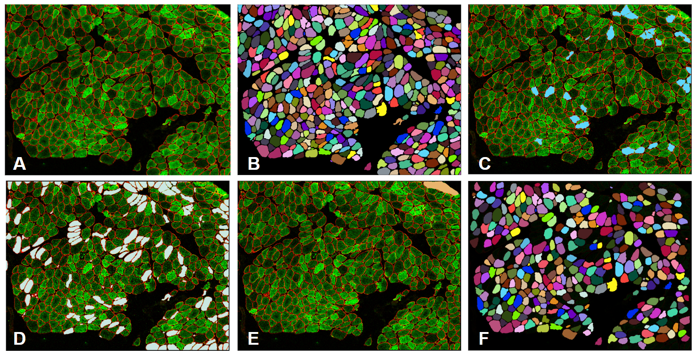

# NCL-SM Dataset
### NCL-SM: Newcastle Skeletal Muscle dataset is a Fully Annotated Dataset of Images from Human Skeletal Muscle Biopsies

* **End-to-end Annotation Process**:  **Tile A**: SM image made by arranging greyscale images of a cell membrane protein marker and mitochondrial mass protein marker into an RGB image where R = membrane protein marker, G = mass protein marker and B = 0; **Tile B**: Manually annotated instance segmentation mask for the image A; **Tile C**: Manually classified mask of Frozen Artefact Myofibres (FAMs) overlaid on the image; **Tile D**: Semi-manually classified mask of Non-Transverse Myofibres (NTMs) mask overlaid on the image; **Tile E**: Manually annotated segmentation mask of Folded tissue Regions (FRs) overlaid on the image; **Tile F**: Final instance segmentation mask of 'Analysable' myofibres made by removing C,D and E from B.*
## NCL-SM Details:

 Download: [link](https://data.ncl.ac.uk/articles/dataset/Newcastle_Skeletal_Muscle_NCL-SM_A_Fully_Annotated_Dataset_of_Images_from_Human_Skeletal_Muscle_Biopsies/24125391)  

 Data directory structure: NCL-SM consist of two directories (i) IMC & (ii) IF. Each of these have 9 directories, the names of the these should explain the content, the three directories with abbrivated names i.e. 'Mask_All_AM' refer to instance segmentation mask of all analysable myofibres, 'Mask_AM_vs_NAM' refer to class mass of analysable vs non-analysable mayofibres and 'Mask_QA' refer to segmentation mask of quality assurance duplicate annotations. 

## NCL-SM Code:

### Non-transverse myofibre (NTM) detection:
The python [script](https://github.com/atifkhanncl/NCL-SM/blob/main/non_transverse_myofibre_detection.py) enables classification of  NTM in a given instance segmentation mask .

### Annotation quality assessement metrics
The [notebook](https://github.com/atifkhanncl/NCL-SM/blob/main/annotation_quality_evaluation_metrics.ipynb) walk through evaluating annotation/segmentation quality of a given instance segmentation mask by comparing it to NCL-SM 'ground truth' mask

## NCL-SM Associated Clinical and Other Information 

Please refere to [clinical info](https://github.com/atifkhanncl/NCL-SM/blob/main/clinical_info.md)
